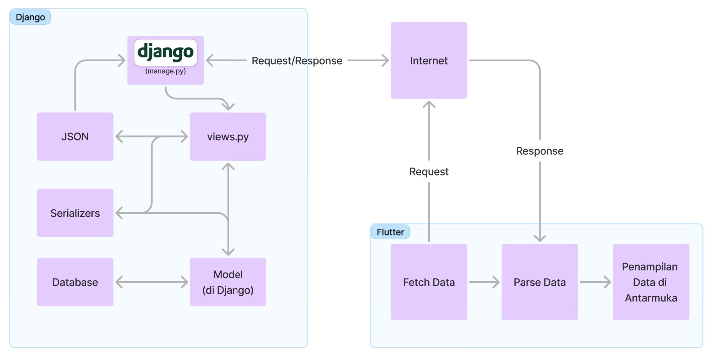

# BekasBerkelas

**BekasBerkelas** _mobile version_ merupakan proyek akhir semester Flutter untuk tugas mata kuliah Pemrograman Berbasis Platform Ganjil 2024/2025 oleh kelompok D12.

## Anggota Kelompok
- Deanita Sekar Kinasih (2306229405) - `deanitasekar`
- Muhammad Naufal Ramadhan (2306241700) - `naufal-ramadhan`
- Ramy Ardya Ramadhan (2306210393) - `UltraRamy`
- Steven Setiawan (2306152260) - `setiawans`
- Wida Putri Kinasih (2306229840) - `widaputri`

### Deskripsi Aplikasi
BekasBerkelas lahir dari kisah inspiratif para pejuang yang datang ke ibukota untuk mengadu nasib. Sebagai pendatang baru di kota besar, mereka menyadari bahwa mobilitas adalah kunci utama untuk bisa bertahan dan berkembang. Banyak dari mereka yang membutuhkan kendaraan untuk pergi ke tempat kerja, menghadiri wawancara, atau hanya sekedar menjelajahi kota. Namun, harga mobil yang kurang terjangkau kerap kali menjadi kendala bagi mereka. Dengan demikian, membeli mobil bekas dapat menjadi solusi alternatif bagi para pendatang. Sayangnya, opsi ini sering kali terhambat karena banyaknya tantangan yang menghadang, seperti kurangnya pemahaman tentang pasar lokal, tingginya kekhawatiran akan tindak penipuan, dan adanya kendala bahasa dalam proses negoisasi.

Di sisi lain, Jakarta sebagai pusat ekonomi Indonesia memiliki dinamika tersendiri dalam penjualan mobil. Kultur konsumtif di kalangan masyarakat mengakibatkan munculnya pandangan kepemilikan mobil sebagai simbol status sosial. Hal ini menyebabkan banyaknya pemilik mobil yang cenderung mengganti kendaraan mereka dengan model terbaru hanya untuk mengikuti tren sosial yang ada. Akibatnya, sebagian besar dari mereka memilih untuk menjual mobil bekas yang masih dalam kondisi baik dan menciptakan ekosistem unik dengan pasokan mobil bekas yang berlimpah. Hal ini tentunya membuka peluang besar bagi para pencari mobil bekas berkualitas, termasuk para pendatang baru.

Melihat tantangan yang dihadapi para pendatang baru serta fenomena unik di kalangan pemilik mobil di ibukota, BekasBerkelas tercipta sebagai solusi komprehensif. Platform ini hadir sebagai jembatan penghubung antara pendatang baru yang mencari kendaraan terjangkau dengan pemilik mobil yang kerap berganti kendaraan untuk mengikuti tren terbaru. Dengan kombinasi fitur-fitur yang menarik, BekasBerkelas akan menjadi teman setia bagi pendatang dalam perjalanan membangun kehidupan di kota baru, sambil memfasilitasi gaya hidup dinamis pemilik mobil di ibukota. 

### Daftar Modul
Berikut adalah daftar modul yang akan kami implementasikan.
| Modul | Penjelasan | Pengembang |
| -- | -- | -- |
| **Authentication** | Modul ini berfungsi agar pengguna dapat melakukan tindakan registrasi, login, dan logout | Steven |
| **User Dashboard** | Modul ini berfungsi untuk menampilkan data pribadi pengguna. Pengguna dapat mengubah data pribadi mereka serta melakukan tindakan sesuai peran yang mereka miliki | Naufal | 
| **Product Catalog**  | Modul ini berfungsi untuk membuat serta menampilkan produk mobil bekas | Ramy |
| **Forum** | Modul ini berfungsi sebagai tempat berdiskusi para pengguna. Setiap pengguna dapat membuat atau bergabung dalam satu forum atau lebih | Steven |
| **Wishlist** | Modul ini berfungsi untuk membuat sistem wishlist bagi para pembeli | Deanita |
| **Review & Rating** | Modul ini berfungsi agar pengguna dapat memberikan review dan rating terhadap penjual mobil | Wida |

### Role pengguna
Berikut adalah _role_ pengguna sesuai modul yang akan diimplementasikan.
| Modul | Pembeli | Penjual | Admin |
| -- | -- | -- | -- |
| **Authentication** | Pembeli dapat melakukan tindakan registrasi, login, dan logout | Penjual dapat melakukan tindakan registrasi, login, dan logout | Admin dapat melakukan tindakan registrasi, login, dan logout |
| **User Dashboard** | Pembeli dapat mengubah data dirinya | Penjual dapat mengubah data dirinya serta melihat daftar rating yang mereka miliki | Admin dapat mengubah data diri serta melakukan tindakan seperti verifikasi penjual baru |
| **Product Catalog** | Pembeli dapat melihat katalog mobil bekas yang ada | Penjual dapat menambahkan mobil bekas yang ingin dijualnya atau menghapus mobil bekas yang sudah terjual. Selain itu, penjual juga dapat melihat mobil bekas yang ada (selain miliknya) seperti pengguna | Admin dapat menghapus produk mobil bekas yang ada pada katalog |
| **Forum** | Pembeli dapat memulai dan melakukan diskusi dalam forum | Penjual dapat memulai dan melakukan diskusi dalam forum | Admin dapat memulai dan melakukan diskusi dalam forum serta menghapus forum yang ada | 
| **Wishlist** | Pembeli dapat menambahkan mobil bekas yang mereka inginkan ke dalam _wishlist_ | Penjual dapat menambahkan mobil bekas (selain milik mereka) yang mereka inginkan ke dalam _wishlist_ | - |
| **Review & Rating** | Pembeli dapat menambahkan review dan rating pada penjual mobil yang telah mereka beli | - | Admin dapat menghapus review dan rating yang ada |

### Sumber Inisial Dataset
[Dataset](https://www.kaggle.com/datasets/indraputra21/used-car-listings-in-indonesia?select=used_car.csv)

### Alur Pengintegrasian dengan _web service_

1. Dalam melakukan integrasi antara Django pada Proyek Tengah Semester dengan Flutter pada Proyek Akhir Semester ini, kami terlebih dahulu melakukan konfigurasi pada setiap endpoint API yang akan menerima request dari Flutter melalui views.py dan mengirimkan data kembali dalam format JSON.

2. Selanjutnya, untuk mengolah data JSON tersebut, kami akan membuat models baru pada Flutter yang sesuai dengan struktur data dari Django models yang telah ada, sehingga data JSON yang diterima dari Backend Django dapat dengan mudah diolah sebagai objek Dart yang dapat digunakan dalam aplikasi.

3. Kemudian, dengan memanfaatkan package http, kita dapat melakukan HTTP requests ke endpoint Django yang telah dikonfigurasi, di mana setiap request akan menyertakan header dan parameter yang diperlukan untuk pengolahan data.

4. Lalu, kami juga akan mengimplementasikan  sistem autentikasi yang memanfaatkan Cookie dari package pbp_django_auth, sehingga pengolahan session dari setiap pengguna/User dapat dilakukan dengan mudah dan benar serta setiap request ke Backend Django telah terautentikasi dengan benar.

5. Setelah itu, kami akan membuat service layer pada Flutter untuk mengelola seluruh komunikasi dengan backend, termasuk implementasi fungsi-fungsi untuk setiap modul yang disesuaikan dengan role masing-masing pengguna.

6. Untuk menampilkan data secara asynchronous, kami akan menggunakan widget FutureBuilder yang akan menangani berbagai state selama proses pengambilan data.

7. Setelah itu, kami juga akan mengimplementasikan state management menggunakan Provider agar state aplikasi kami dapat diolah secara efisien dan data yang diterima dari backend dapat diakses oleh berbagai widget dalam aplikasi dengan mudah.

8. Kami juga akan mengimplementasikan beberapa error handling yang diperlukan pada Flutter untuk menangani berbagai kemungkinan response dari backend Django.

Dengan integrasi di atas, alur penggunaan dapat dijabarkan sebagai berikut:

1. Pengiriman HTTP Request dari Flutter:
   - Pengguna mengirimkan HTTP Request ke salah satu endpoint di Django

2. Pemrosesan HTTP Request di Django:
   - Django menggunakan urls.py untuk menentukan fungsi pada views.py yang sesuai dengan permintaan
   - Jika permintaan memerlukan akses data dari database, Django akan menggunakan models.py untuk berinteraksi dengan database dan mendapatkan data tersebut

3. Pengiriman HTTP Response dari Django:
   - Data yang telah diambil kemudian disusun dalam format JSON
   - Django akan mengirimkan HTTP Response berisi JSON data tersebut ke Flutter

4. Penampilan Data pada Antarmuka di Flutter:
   - Flutter menerima dan melakukan parsing data JSON tersebut sesuai model yang sudah ditentukan
   - Tampilan antarmuka akan disesuaikan dengan hasil proses tersebut 
